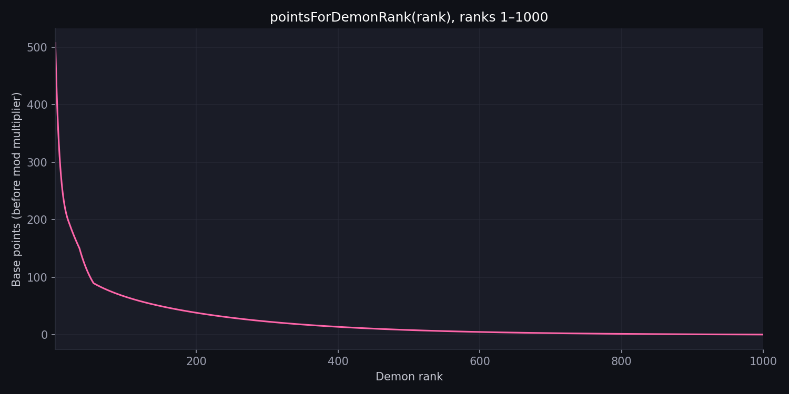

# osu! demon list

A community demon list for osu! standard — ranks the hardest ranked beatmaps by star rating and time and tracks who full comboed them

Refreshes twice a day.

---

## Points system

The position a map is on the demon list determines how much it's worth. (full combo detection is still wonky, however, as you must detect it through maxcombo.)

### Demon rank to points curve



- **Rank 1** awards ~350 base points.

- **Rank 1000** awards the minimum values

- Everything in between follows a piecewise exponential curve, linearly rescaled so rank 1 always hits the target.

- Ranks 200–400 receive a small boost

### Piecewise formula

The raw curve `f(x)` before rescaling:

| Range | Formula |
|---|---|
| x ≤ 20 | `(250 − 100.39) × 1.168^(1−x) + 100.39` |
| 20 < x ≤ 35 | `(250 − 83.389) × 1.0099685^(2−x) − 31.152` |
| 35 < x ≤ 55 | `212.61 × 1.036^(1−x) + 25.071` |
| x > 55 | `56.559857 × e^(−0.005 × (x − 55))` |

The raw values are then linearly scaled so that f(1) is 350 points.

```
points(x) = (f(x) × scale + offset) × midrangeMultiplier(x)
```

 `midrangeMultiplier(x)` is `1 + 0.01 × smoothstep(200, 220, x) × (1 − smoothstep(380, 400, x))`.

The full system is in [`src/scoring.ts`](src/scoring.ts).

### Mod multipliers

Mods increase the points gained per map.

| Mods | Multiplier |
|---|---|
| NM / CL | × 1.00 |
| HD | × 1.05 |
| HR | × 1.20 |
| HD + HR | × 1.26 |

---

## Score qualification rules

A score is an FC if it is:

- **Ranked maps only.** i tried to make loved maps count too but that introduced too much funk

- **Mods:** NM, Classic (CL), Hidden (HD), Hard Rock (HR), or any combination of those. DT, EZ, etc. disqualify the score.

- **Full combo:** at least **95% of the map's max combo** with no miss or combo-breaks

The first qualifying FC on a map earns the **verified** role; every subsequent FC earns a **victor** number in chronological order.

---

## Setup

### Prerequisites

- Node.js 22+

- An [osu! OAuth application](https://osu.ppy.sh/home/account/edit#oauth) (client credentials grant)

### Environment variables

Create a `.env` file at the repo root (or export these in your shell):

```
OSU_CLIENT_ID=your_client_id
OSU_CLIENT_SECRET=your_client_secret
```

### Install and build

```bash
npm install
npm run build
```

### Generate the leaderboard locally

```bash
# Write to output/
node dist/index.js --out=output

# Or use the npm shortcut
npm run generate:leaderboard
```

### CLI flags

| Flag | Default | Description |
|---|---|---|
| `--target=N` | 1000 | Number of maps to collect |
| `--max-pages=N` | 3000 | Max beatmapset search pages to crawl |
| `--delay-ms=N` | 120 | Delay between API requests (ms) |
| `--out=PATH` | `output/` | Output directory |
| `--sample=N` | — | Collect only N maps (quick test) |
| `--strict-fc` | — | Require `is_perfect_combo` / `legacy_perfect` flag |
| `--lenient-fc` | ✓ | Accept any pass with ≥95% combo and no miss stats |
| `--additive` | — | Preserve existing list and append new maps |
| `--backfill` | — | Resume scan and fill gaps without replacing the list |

---

## Outputs

After a run, the `output/` (or `web/data/`) directory contains:

| File | Description |
|---|---|
| `leaderboard.json` | Full structured data (maps + player leaderboard) |
| `leaderboard.md` | Human-readable markdown table |
| `leaderboard.csv` | `userId,username,totalPoints` CSV |

---

## Automated updates

The GitHub Actions workflow ([`.github/workflows/update-leaderboard.yml`](.github/workflows/update-leaderboard.yml)) runs a full scan at **06:00 and 18:00 America/Los_Angeles** every day, commits the updated `web/data/` files, and Vercel redeploys automatically.

---

## Scripts

| Script | Description |
|---|---|
| `scripts/plot-demon-rank-curve.py` | Regenerates `docs/demon-rank-points-curve.png` |
| `scripts/recompute-web-points.ts` | Reapplies the current scoring formula to `web/data/leaderboard.json` without a full API rescan |
| `scripts/enrich-hit-length.ts` | Backfills `hitLength` for maps missing that field |

```bash
# Regenerate the curve plot
python3 scripts/plot-demon-rank-curve.py

# Recompute points after a formula change
npx tsx scripts/recompute-web-points.ts
```

---

## License

[MIT](LICENSE)
